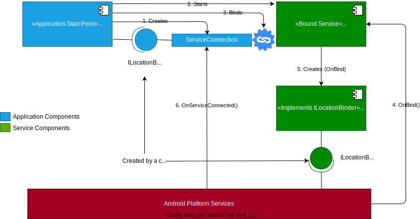

# Introduction
This repository contains a starting point for all your MAUI applications that starts an Android Bound Service.

The best way to use this is to open the solution in your visual studio, and export the project MauiAppSample as a "Visual Studio Template" (Project -> Export Template) after selecting the project.

The sample follows the directory structure very simular to the [MauiAppSample](https://github.com/arvindd/MauiAppSample).

# What does this sample do?
Well, the sample application is really very simple - it just shows up a button, which when clicked, enables a location service to begin receiving (fake) location information. THe location information is simply some random numbers for latitude and longitude generated by the Bounded Service LocationService, that is started by the MauiApp.

The numbers are shown on a ListView that is just above the button. Everytime the button is clicked, some numbers are added to this ListView.

This button is simply labelled "Track Location" and the numbers that show up on the ListView are the latitude and longitude values of a location.

# Who can use this sample?
Everyone who develops mobile applications use [MAUI](https://dotnet.microsoft.com/en-us/apps/maui)

**AND**

Uses [Reactive Extensions](https://www.reactiveui.net/) (with all it's niceties such as Observables, Dynamic Data, etc.).

**AND**

Starts an [Android Bound Service](https://learn.microsoft.com/en-us/xamarin/android/app-fundamentals/services/creating-a-service/bound-services)

**AND**

Uses **[AIDL]**(https://developer.android.com/guide/components/aidl) for communicating with the bound service.

If either of these are **NOT** a target of your application's design, this sample is **NOT** for you.

The sample is heavily influenced by a superb sample in the ReactiveUI - [Cinephile](https://github.com/reactiveui/ReactiveUI.Samples/tree/main/Xamarin/Cinephile). Cinephile is done for Xamarin, while this sample is for MAUI.

# How to...
## ...Add all application components such as pages, services, models, etc.
See the MauiAppSample.

## ...Add a bounded service to be started by the Maui App?

**TO BE DOCUMENTED**

# Architecture of the sample
An overview of any application using the Android Bound Service with AIDL is as given in the picture below.

# Folders and files

The sample has the following folders and files (apart from the usual Visual Studio files):

Folder/File | Contents
----------- | ---------
[App.xaml](MauiAppSample/App.xaml) | Application front-end
[App.xaml.cs](MauiAppSample/App.xaml.cs) | Application front-end code-behind, our starting point
[AppBootstrapper.cs](MauiAppSample/AppBootstrapper.cs) | Bootstrapping code that initialises the logging system, and registers various services using the `AppConfig` (below). It also connects ViewModels a Views (registers an `IViewFor`)
[AppConfig.cs](MauiAppSample/AppConfig.cs) | Application configuration. It also "injects" a concrete implementation for services.
[Pages](MauiAppSample/Pages) | Folder that contains both the XAML and code-behind of all the application pages. All pages derive from the `BasePage` (below).
[Pages/BasePage.cs](MauiAppSample/Pages/BasePage.cs) | Base class for all application pages, that forces a template for using the logging system in all pages, and also connecting a page with its ViewModel
[Views](MauiAppSample/Views) | Folder containing custom-control's XAML and their code-behind.
[Views/BaseView.cs](MauiAppSample/Views/BaseView.cs) | All custom-control views derive from this, similar to the `BasePage`.
[Views/BaseViewCell.cs](MauiAppSample/Views/BaseViewCell.cs) | All ViewCells (eg: data template items inside a `ListView`, etc.) derive from this
[ViewModels](MauiAppSample/ViewModels) | Folder containing all the ViewModels of the Views and Pages. 
[ViewModels/BaseViewModel.cs](MauiAppSample/ViewModels/BaseViewModel.cs) | All ViewModels derive from this class
[Services](MauiAppSample/Services) | Folder containing all services. 
[Services/Mock](MauiAppSample/Services/Mock) | Since services can be complex, they also need an ability to "mock" by generating fake data during the development time. All such "mock" services go here.
[Services/Base](MauiAppSample/Services/Base) | All base-classes of individual services go here. Both the real service and the mock services derive from the base-service defined here.
[Services/BaseService.cs](MauiAppSample/Services/BaseService.cs) | All base-services (in the [Services/Base](MauiAppSample/Services/Base) folder) derive from this class. This enables logging for all services.

# Feedback
If you liked this sample, or want to feedback, just star this project and spread the word! If have a request or spot a bug, raise an issue.